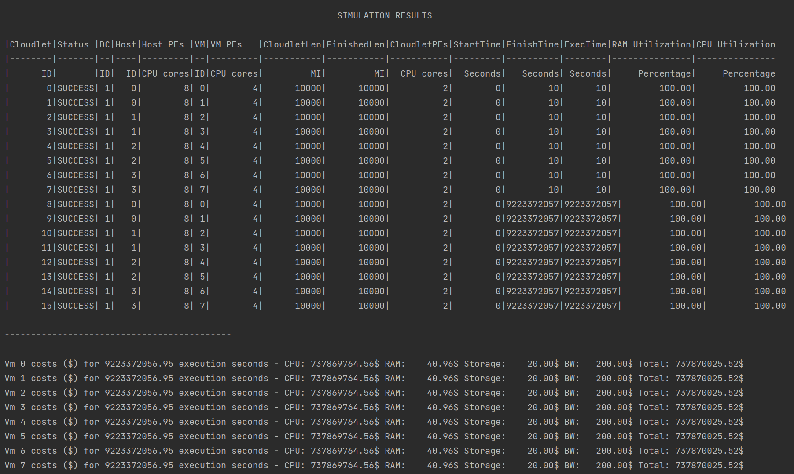

# CloudSim_CS441_HW3
## Utsav Sharma
### UIN: 665894994
### NetID: usharm4@uic.edu

Repo for the Cloudsim Plus Homework-3 for CS411-Fall2022

---

Docker file: [Docker Hub](https://hub.docker.com/repository/docker/utsavns96/cloudsim)
 To run the file, use `docker run utsavns96/cloudsim:latest` in a terminal on a machine that has docker installed.
---

## Running the project

1) Download the repo from git.
2) To compile the project, navigate to its directory and run `sbt clean compile` in the terminal
3) To run the project, run `sbt run` in the terminal and choose the simulation from the menu by entering the corresponding number and pressing `Enter`
4) TO run the test suite, run `sbt test` in the terminal window.

### Creating the Docker Image:
1) Create a fat jar using `sbt assembly`
2) Create the Dockerfile with no file extension and give the requisite parameters
3) Use `docker build -t <name>` to build
4) The image should be available in Docker Desktop now.
5) Use `docker tag <name> <username>/<name>:latest` to tag the image
6) use `docker push <username>/<name>:latest` to push the image to a dockerhub repo

---

## Technical Design
This project is split into 5 different simulations that we will look at below. All programs use config files and create logs in the /log directory of the project.

### 1) RunJobs.scala
This program acts as our menu for running our 5 simulations. 
[1] runs the VMAllocation simulation  
[2] runs the VMUtilAndSchedule simulation  
[3] runs the Network simulation CloudProvider with multiple datacenters  
[4] runs the ScalingDatacenter simulation  
[5] runs the Grad simulation for Iaas, Paas and Saas.

### 2) VMAllocation.scala
This simulation runs two Cloudsim simulations that compare the effects of different VM allocation policies. 
For the first simulation, we first load our configs and create a new simulation. Then, we create a new datacenter with hosts and processing elements.
The datacenter is created through `CreateObjects.createDatacenter` in the `CreateDatacenter` package where first we create the number of hosts that are specified in the config files.
The hosts are created using createHost, where the PEs are generated from 1 to the number of PEs from the config files, and the power model is set for each host. The hosts are returned to the createDatacenter, where they are added to a list, and finally the list of hosts is added to the datacenter. 
Then, a broker is created for this simulation, followed by creating the list of VMs that we need to run on these hosts. The list of VMs is generated through `CreateObjects.createVms`, where we pass the VM configs from the config file.
`createVM` returns a list of VMs to our program after creating a new VM, setting the parameters such as RAM, Bandwidth, etc and adding them to a list. The VM list is copied to a second val to be used later for our second simulation. 
The cloudlets are created after this, where we pass the utilization model and the cloudlet parameters from the config file, and get a list of cloudlets in return after they have been created in `CreateObjects.createCloudlets`.
We set the VM allocation policy to `VmAllocationPolicyFirstFit` and then submit our VM list and cloudlet list to the broker. 
The simulation is then executed and the results of the simualtion are printed to the terminal. This ends our first simulation for this program. 
For the second simulation, we take the same steps as above, but instead of First Fit, we use `VmAllocationPolicyRoundRobin`. The simulation is then run and the results are printed as stdout. This end the second simulation.

### 3) VMUtilAndSchedule.scala
This program runs two Cloudsim simulations that compares different VM Scheduler and Utilization policies. To do this, we first run a simulation just as described above. However, while creating our datacenters we specify the first datacenter to use VmSchedulerSpaceShared, and the second datacenter to use VmSchedulerTimeShared. (This is controlled through the config file and can be flipped around too.) 
The cloudlets in the first simulation use UtilizationModelStochastic, while the second simulation use UtilizationModelFull. 
In the third and fourth simulations, we keep the Cloudlet utilization as Full for both, and then change the first datacenter to use a SpaceShared VMScheduler. 
This program is capable to testing any combination of VMScheduler TimeShared, SpaceShared and Utilization model Stochastic and Full.
While creating the datacenters, we also specify the costs the datacenter has, which we then use at the end of the simulations to collect the cost of running our particular setup.

### 4) CloudProvider.scala
This program implements network topologies in multiple datacenters. To do this, we first start with loading our configurations, after which we create our simulation. THen, we create our first network datacenter using `CreateObjects.createNetworkDatacenter`. We pass the host configurations, the simulation and the datacenter configurations to this.
In createNetworkDatacenter, we create a list of hosts that we populate using createNetworkHost where the processing elements are created and passed to NetworkHost to create new hosts, after which a power model is added to the hosts.
Once this is done, we configure the costs of the datacenter and specify it to use VmAllocationPolicyFirstFit. 
Now, we create a Tree network topology for this datacenter using the configurations of the various switches from the CloudProvider.conf file. To create this topology, we generate our edge switches, aggregate switches and root switch and set their respective parameters. Then, the edge switches are connected to the hosts first, after which the aggregate switches are connected to the root switch.
To connect our edge switches to our root switch, we first find how many edge switches we need to add to each aggregate switch, and how many such switches we need to use. Then, for every aggregate switch, we add the corresponding edge switches after checking if they have been previously connected or not. If not, they are connected to that aggregate switch.  
  
The second datacenter is then created using similar steps as the first, where we create the hosts and datacenter, and then set the costs. However, this time we create a Mesh topology for this datacenter.
The mesh network uses a lot more switches and connections than the tree network, but provides theoretically higher connectivity and redundancy. To create the mesh network, we generate the edge, aggregate and root switches as before, but generate an additional layer of aggregate switches than lie in between the first layer of aggregate switches and the root switch.
To set up our connections, we start with connecting our all the hosts to all our edge switches, and all our aggregate switches to all our edge switches. Then, we connect the second layer of aggregate switches to the base layer by using a method similar to the one used in the tree topology to connect the edge switches to the aggregate switches. This helps us create redundant paths and increase the connectivity in the topology. After this, the second layer of aggregate switches are finally connected to the root switch. Additionally, we also connect each aggregate switch in the second layer to its neighbours, further increasing our number of paths.
 Now, our datacenter are connected to each other, and we can create our VMs and Cloudlets. To create the VMs, we use `CreateObject.createNetworkVms`, which works similar to `CreateObject.createVms` that we have used before, but generates NetworkVms instead of simple VMs. We pass parameters from the config file, and after creating the NetworkVm and setting its parameters, we get a list of NetworkVMs in return.
After this, we create our Networkcloudlets using `CreateObjects.createNetworkCloudlets`, which gives us a list of NetworkCloudlets in return, after creating them and setting their parameters. 
The cloudlets are then assigned to VMs, where the half the cloudlets are assigned to the first datacenter that uses a tree network using a first-fit policy, and the second half are assigned to the second datacenter which uses a mesh topology through a round-robin method.
After our cloudlets have been assigned, the program gives map/reduce tasks to the first set of cloudlets in the tree topology datacenter, and gives a diffusion task to the cloudlets in the second, mesh topology datacenter. THe map/reduce tasks are divided evenly among the cloudlets in the tree datacenter, where half the cloudlets perform the mapper task, and the other half perform the reducer task.
 The Vm list and Cloudlet list are submitted to the broker, and the simulation is then started. The results are collected once the simualtion ends, and are placed in files for easy analysis. The power model information is stored in `CloudproviderPower.txt`, the cost information is stored in `CloudproviderCost.txt`, and the general simulation information is stored in `CloudproviderStats.csv`  
  

The structure of our Cloud Provider setup looks like this: 
 
### 5) ScalingDatacenter.scala
This program creates tens of thousands of hosts, VMs and Cloudlets, and performs the simulation of scaling the VMs as more cloudlets arrive while the simulation runs. 
To do this, we first load our configs and create the simulation. Then, the datacenter is created like the programs above and the scheduling interval is set from the config file. We create a new broker, and then add a listener for the simulation. This enables us to add cloudlets while the simulation runs, mimicking the arrival of new cloudlets. To add new cloudlets, we get the current time of the event that triggered the method, and we check if that time is divisible by the creation interval in the configs and is also less than the specified limit. If yes, we create a list of new cloudlets and assign them various parameters such as their length, a random submission delay, utilization model, etc. The newly created cloudlets are then submitted to the broker.
 We create a list of new cloudlets, submit the VMs and Cloudlets to our broker, and start the simulation. Every time the listener is triggered, the method described in the lines above runs and adds new cloudlets to the simulation, which identifies if it is overloaded using the predicate defined in `isVmOverloaded`. If the CPU utilization of the VM is above 70%, and the ram utilization of the host is above 50%, the datacenter scales by adding another VM so that the new cloudlets can be assigned to that VM.
 Once the simulation finished running, the output is placed in files `CloudproviderStats.csv`,`CloudproviderCost.txt`, and `CloudproviderPower.txt`.

### 6) IaasPaasSaas.scala
This is the final grad-only simulation, where the program creates 3 datacenters to implement Iaas, Paas and Saas models. 
To achieve this, the program creates 3 datacenters, where the configurations are divided betwween the provider and the user. For Iaas, the provider defines the basic details such as the hosts and costs, along with which VM scheduler to use, and it is up to the user to define the other configurations of the VMs and cloudlets. 
For Paas, the provider defines everything in the Iaas model, plus the configurations of the VMs and the number of processing elements that each cloudlet gets. The user defines the details of how many VMs they want to spin up, and how many cloudlets of what length and size are required. 
For Saas, the cloud provider defines most of the configurations, leaving the user to only control how many cloudlets they want to run, of what length and size, effectovely allowing them only to control the number of application instances that they can run. 
Once the three datacenters are created, the Vms are spun up from all 3 configurations and submitted to the broker. The cloudlets are also generated from the 3 configurations and submitted to the broker. Then, the simulation is executed and the results of the simulation, cost and power are printed in the stdout.

## Results:

### 1) VMAllocation.scala
Simulation 1: 

 Simulation 2: 

 
### 2) VMUtilAndSchedule.scala
TimeShared and Stochastic Utilization: 
 
TimeShared and Full utilization: 
 
SpaceShared and Full utilization: 
 
TimeShared and Full utilization: 
 
### 3) CloudProvider.scala
Execution Stats: 

 Cost Data: 

 Power Data: 

 
### 4) ScalingDatacenter.scala
Execution Data: 

 Cost Data: 

### 5) IaasPaasSaas.scala

## Analysis:

### 1) VMAllocation.scala
This simulation shows us the effects of different VM Allocation policies. The first simulation shows us how the first-fit policy works, where VM0 is allocated to Host 0, VM1 is allocated to Host 0, VM2 is allocated to Host 1, VM3 is allocated to Host 1, and so on.
In first-fit, the VMs are allocated to the first host that fits our criteria of space, utilization, etc. We check the first host, and if it fits our criteria, we allocate the VM to it. If not, we move to the next host and check. This process goes on till we find a space for our VM and after it has been assigned, the process starts again for the next VM in our list. 
The second simulation uses a round-robin allocation to allocate VMs to hosts, where VM0 is allocated to Host 0, VM1 is allocated to Host 1, VM2 is allocated to Host 2, VM3 is allocated to VM3, and so on.
Round Robin moves through the Hosts and assigns the VMs one by one, which means that the first host gets the first VM, the second host gets the second VM, upto the last host getting its corresponding VM. Then, the algorithm loops back to assign the next VM to host 0.
THe process continues till all the hosts are assigned.

### 2) VMUtilAndSchedule.scala
This simulation outlines the differences between the VM Scheduling policies of Space Shared and Time Shared. ALong with this, we can also see the effects of the cloudlet utilization models of Stochastic and Full.
Using TimeShared for both, we can see the differences between utilization model stochastic and full - In stochastic, the VMs run for 27s and cost us $263.15. However, using UtilizationModelFull, we can see that half our cloudlets do not have enough resources to run, and ultimately are unable to execute, costing us millions of dollars. 
The second experiment we run with this simulation is keeping both utilization models at full, and configuring the first simulation to use a Space Shared scheduler, while the second simulation uses a Time Shared scheduler.
This time, we can see that neither of the simulations have all cloudlets complete successfully, and end up costing millions of dollars.

### 3) CloudProvider.scala
The third program shows us how networks behave in the simulation. We create two datacenters, one using a tree network and one using a mesh network. The datacenter with the tree network is assigned a map/reduce task, and the datacenter with the mesh network is assigned a diffusion task. 
This simulation not only introduces networks, but also shows us how tasks work with cloudlets, and how tasks can be added one after the other to cloudlets for sequential execution. We also see how data transfer can be simulated in the network using the send and receive tasks, and how a task will wait for receives to happen before execution of any further tasks. We also see how costs differ with execution time and task size.
We can deduce that a mesh network, while introducing more links that serve to reduce congestion in the network, is more expensive, since it uses many more switches with far higher port counts, and similarly high number of connecting wires between elements, which drives up the cost of implementing this network as opposed to a simple tree-based network. 

### 4) ScalingDatacenter.scala
This simulation shows us how a datacenter can react to an incoming dynamic workload by adding more VMs as needed. We start of with 10,000 hosts, with only 10,000 VMs hosted which run 20,000 cloudlets. During the course of execution we use a listener to add more cloudlets, simulating the arrival of workloads while the datacenter is running. The datacenter uses the predicate - is CPU utilization > 70% and is the RAM utilization > 50%. If this is satisfied, a new VM is spun up and added to our datacenter. 
One important thing to note here is that there must be free hosts available to host this new datacenter, or else there will be no machines available to allocate the VM to which would make scaling useless.

### 5) IaasPaasSaas.scala
This is the last simulation that is only for grad students - here we initialize 3 different datacenters which offer different models of the cloud services. The first datacenter offers us Iaas, the second offers us Paas and the third offers us Saas. These models are implemented using config files with varying degrees of user control between the models.
An Iaas user has full control of the VMs and cloudlets that they spin up, while a Paas User can only define how many VMs they need and some of the cloudlet settings. A Saas user can only decide what size their workload is by controlling the bare minimum of cloudlet settings. 
The rest of settings in these models are locked behind the Provider config files, which the Cloud Provider uses to provision the rest of the resources. This simulation shows us how we can offer three different models using three different datacenters, and let the broker decide how to distribute the workloads.

## Test Cases:
These are run through the command `sbt test`.

| Case No. | Test Name                                                                | Test Steps                                                                                                                                                                                                                                         | Expected Result                                             | Actual Result                                                                    | Pass/Fail |
|----------|--------------------------------------------------------------------------|----------------------------------------------------------------------------------------------------------------------------------------------------------------------------------------------------------------------------------------------------|-------------------------------------------------------------|----------------------------------------------------------------------------------|-----------|
| 1 | Check if VmAllocation.conf file is present | (1.) Load config file VmAllocation.conf   (2.) Assert that the file is present| The file is present.| The file is present in the /resources directory. | Pass |
| 2 | Check if VmUtilAndSchedule.conf file is present | (1.) Load config file VmUtilAndSchedule.conf   (2.) Assert that the file is present  | The file is present. | The file is present in the /resources directory.  | Pass |
| 3 | Check if CloudProvider.conf file is present | (1.) Load config file CloudProvider.conf   (2.) Assert that the file is present | The file is present.| The file is present in the /resources directory. | Pass |
| 4 | Check if ScalingConfig.conf file is present| (1.) Load config file ScalingConfig.conf   (2.) Assert that the file is present | The file is present.| The file is present in the /resources directory.  | Pass |
| 5 | Check if all configs of IaasPaasSaas are present | (1.) Load config file IaasProvider.conf, IaasUser.conf, PaasProvider.conf, PaasUser.conf, SaasProvider.conf,SaasUser.conf   (2.) Assert that the files are present| The files are present. | The files are present in the /resources directory.| Pass |
| 6 | Unit Test for VM instances being created |(1.) Load configs for VMs from VmAllocation.conf (2.) Create VMs using CreateObjects.createVms |The value returned should be of type java.util.ArrayList[Vm] | The value returned is of type java.util.ArrayList[Vm] | Pass |
| 7 | Unit Test for Datacenter being created  | (1.) Load configs from VmAllocation.conf (2.) Create a new simulation (3.) create a new datacenter using CreateObjects.createDatacenter  | The val datacenter should be of type Datacenter | The val datacenter is of type Datacenter| Pass |
| 8 | Unit test for for hosts being created |  (1.) Load configs from VmAllocation.conf  (2.) create hosts using CreateObjets.createHost  | The val host should be of type Host| The val host is of type Host| Pass |
| 9 | Unit test for all VMs being allocated | (1.) Load configs from VmAllocation.conf   (2.) Create a new simulation   (3.) create a new datacenter   (4.) create a new broker   (5.) create new VMs  (6.) Create new cloudlets (7.) submit Vms to broker (8.) Submit cloudlets to broker (9.) Start the simulation (10.) Assert that the size of broker.getVmCreatedList should equal the size of the vmlist   | The size of broker.getVmCreatedList should equal the size of the vmlist  | The size of broker.getVmCreatedList equals the size of the vmlist | Pass |
| 10 |Unit test for all cloudlets finishing execution | (1.) Load configs from VmAllocation.conf   (2.) Create a new simulation   (3.) create a new datacenter   (4.) create a new broker   (5.) create new VMs  (6.) Create new cloudlets (7.) submit Vms to broker (8.) Submit cloudlets to broker (9.) Start the simulation  (10.) Assert that the size of broker.getCloudletFinishedList equals the size of the cloudlets list | The size of broker.getCloudletFinishedList equals the size of the cloudlets list | The size of broker.getCloudletFinishedList equals the size of the cloudlets list | Pass |
---

## Limitations:
1) The user of this simulation must have Java 17 installed on their machine.
2) The networks are created using code instead of BRITE files (since I could not get them working in the time I had), which means that reconfiguring the networks requires code changes.
3) Some of the larger simulations have a lot of data to process, which is put in the corresponding CSV and TXT files. The CSV files must be formatted using Text to Column in Excel before it can be used to infer the output of the simulation.
4) The program hangs in docker with the number of hosts/VMs/cloudlets set to tens of thousands, so this has been reduced to the thousands for just the docker image. It runs fine locally.
